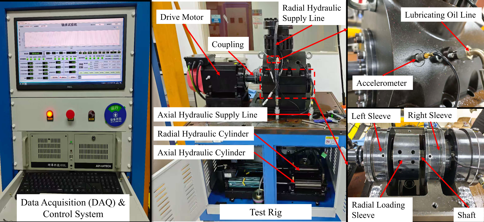
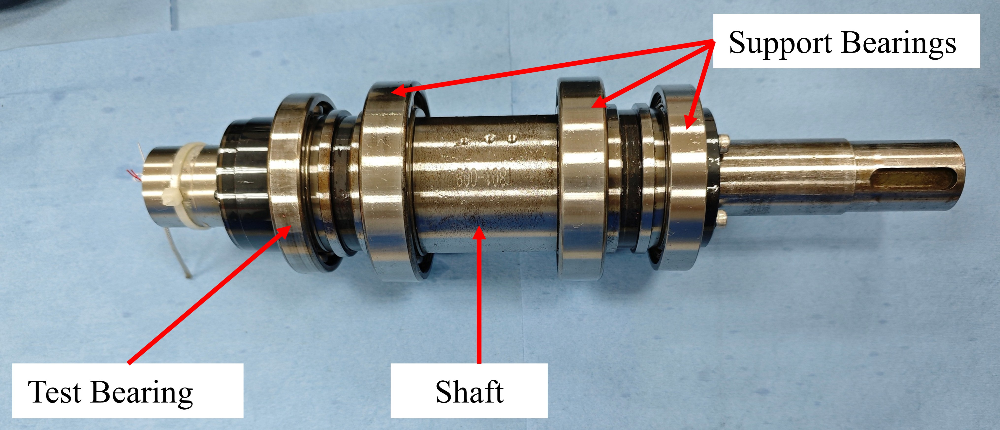

# CEPREI-6909 Dataset

The **CEPREI-6909 Dataset** is a vibration-signal bearing fault diagnosis dataset collected on a 6909 deep groove ball bearing test rig under a dense grid of speeds, radial loads, and fault types. The public release includes **7 bearing conditions**, corresponding to one healthy condition and six fault conditions. Its main feature is the broad coverage of compound operating conditions: six conditions provide a full **6-load x 10-speed** operating-condition grid, covering 60 load-speed combinations per condition. To the best of our knowledge, CEPREI-6909 is among the first public bearing fault diagnosis datasets with this level of load-speed condition richness and systematic coverage.

This public release contains **vibration signals only**. Acoustic/sound signals were collected during the experiments but are not included in this public version.

## Download

The full vibration dataset is distributed as a compressed archive through Quark Cloud Drive. This GitHub repository is used as the public dataset homepage and contains only the documentation and illustrative figures.

> **Quark Cloud Drive:** [https://pan.quark.cn/s/056ce0f0d41b](https://pan.quark.cn/s/056ce0f0d41b)

After downloading and extracting the archive, the data directory should follow the package structure described below.

## Associated Paper

If you use this dataset, please cite the associated paper:

> Yu Wang, Chenyu Jiang, Qiang Chen, Shujie Liu, Weiwei Liu.  
> **Causal prototype variational information bottleneck framework for cross-domain fault diagnosis**.  
> *Engineering Applications of Artificial Intelligence*, Volume 177, Part 1, Article 114934, 2026.  
> DOI: [10.1016/j.engappai.2026.114934](https://doi.org/10.1016/j.engappai.2026.114934)

BibTeX:

```bibtex
@article{wang2026cpvib,
  title = {Causal prototype variational information bottleneck framework for cross-domain fault diagnosis},
  author = {Wang, Yu and Jiang, Chenyu and Chen, Qiang and Liu, Shujie and Liu, Weiwei},
  journal = {Engineering Applications of Artificial Intelligence},
  volume = {177},
  number = {Part 1},
  pages = {114934},
  year = {2026},
  doi = {10.1016/j.engappai.2026.114934}
}
```

## Experimental Platform

The experiments were conducted through a collaboration between the State Key Laboratory of High-performance Precision Manufacturing, Dalian University of Technology, and China CEPREI Laboratory. The experimental platform was provided by China CEPREI Laboratory and consists of a bearing test rig equipped with a drive motor, coupling, hydraulic loading system, lubrication system, data acquisition and control system, and accelerometer-based vibration measurement.

<p align="center">
  
</p>

The test bearing was mounted on a shaft with support bearings. The figure below illustrates the shaft assembly and the position of the test bearing.

<p align="center">
  
</p>

## Bearing Specification

| Item | Specification |
|---|---|
| Bearing type | Deep groove ball bearing |
| Bearing model | 6909 |
| Inner diameter | 45 mm |
| Outer diameter | 68 mm |
| Width | 12 mm |
| Dynamic load rating, Cr | 14 kN |
| Static load rating, C0r | 10.8 kN |
| Ring and rolling element material | Steel |

## Dataset Overview

| Item | Value |
|---|---:|
| Released signal type | Vibration only |
| Bearing model | 6909 |
| Number of released bearing conditions | 7 |
| Number of bearing-load operating domains | 37 |
| Full load-speed grid conditions | 6 bearing conditions |
| Load-speed combinations per full-grid condition | 60 |
| Speed points per released domain | 10 |
| CSV files per speed point | 25 |
| Total CSV files | 9,250 |
| Sampling frequency | 10 kHz |
| Acquisition interval per sample file | 3 s |
| File format | Headerless CSV |

Each CSV file is a comma-separated numeric time-series file. In this release, each vibration CSV contains two numeric columns and no header row.

## Fault Classes

The released dataset contains seven bearing conditions: one healthy condition and six fault conditions. These conditions can be treated as seven diagnostic classes.

| Bearing ID | Health state | Fault location | Fault type | Fault size or description |
|---|---|---|---|---|
| B00 | Normal | None | None | Healthy bearing |
| B02 | Faulty | Inner ring raceway | Slot defect, medium severity | 0.4 mm width x 0.3 mm depth |
| B03 | Faulty | Inner ring raceway | Slot defect, severe | 0.6 mm width x 0.3 mm depth |
| B05 | Faulty | Outer ring raceway | Slot defect, medium severity | 0.4 mm width x 0.3 mm depth |
| B06 | Faulty | Outer ring raceway | Slot defect, severe | 0.6 mm width x 0.3 mm depth |
| B08 | Faulty | Rolling element | Circular pit defect | 0.6 mm diameter x 0.3 mm depth |
| B09 | Faulty | Cage | Cage fracture | Broken/fractured cage |

Recommended numeric labels are provided below for convenience. Users may adapt the label scheme according to their own tasks.

| Label | Bearing ID | Class name |
|---:|---|---|
| 0 | B00 | Normal |
| 1 | B02 | Inner ring raceway slot, medium severity |
| 2 | B03 | Inner ring raceway slot, severe |
| 3 | B05 | Outer ring raceway slot, medium severity |
| 4 | B06 | Outer ring raceway slot, severe |
| 5 | B08 | Rolling element circular pit |
| 6 | B09 | Cage fracture |

## Operating Conditions

The dataset was designed to provide unusually rich operating-condition coverage. For six bearing conditions (B00, B02, B03, B05, B06, and B08), vibration signals were collected under 6 radial loads and 10 rotating speeds, resulting in 60 load-speed combinations per condition. This dense two-dimensional operating grid supports challenging evaluation of cross-load, cross-speed, and compound load-speed generalization.

Each bearing-load combination may be treated as an operating domain for cross-domain experiments.

### Speed Conditions

For every released bearing-load domain, vibration data are organized under the following 10 speed folders:

```text
300rpm, 600rpm, 900rpm, 1200rpm, 1500rpm,
1800rpm, 2100rpm, 2400rpm, 2700rpm, 3000rpm
```

Each speed folder contains 25 CSV files.

### Radial Load Coverage

| Bearing ID | Radial loads included |
|---|---|
| B00 | 320N, 420N, 820N, 1220N, 1620N, 2020N |
| B02 | 320N, 420N, 820N, 1220N, 1620N, 2020N |
| B03 | 320N, 420N, 820N, 1220N, 1620N, 2020N |
| B05 | 320N, 420N, 820N, 1220N, 1620N, 2020N |
| B06 | 320N, 420N, 820N, 1220N, 1620N, 2020N |
| B08 | 320N, 420N, 820N, 1220N, 1620N, 2020N |
| B09 | 320N |

The public release therefore contains 37 bearing-load domains:

```text
6 bearings x 6 radial loads + 1 bearing x 1 radial load = 37 domains
```

The cage-fracture case (B09) was measured only under the 320N radial-load condition for experimental safety reasons. This design also introduces a realistic class/domain imbalance into the dataset, making the benchmark more challenging for robust fault diagnosis methods.

## Repository Contents

This GitHub repository is intentionally lightweight. It does not store the full CSV dataset directly.

```text
CEPREI-6909/
|-- README.md
|-- test_rig_and_sensor_layout.jpg
`-- shaft_assembly_and_test_bearing.jpg
```

The complete vibration data are provided in the downloadable compressed archive linked in the Download section.

## Download Package Structure

After extracting the compressed dataset archive, the vibration data are organized by experiment folder, signal type, speed, and CSV file.

```text
CEPREI-6909 Dataset Archive/
|-- 2025080503-320N-6909-B02-wy- 6909/
|   `-- VIBRATION/
|       |-- 300rpm/
|       |   |-- VIBRATION_2025-08-05_08-59-xx.csv
|       |   `-- ...
|       |-- 600rpm/
|       |-- 900rpm/
|       |-- 1200rpm/
|       |-- 1500rpm/
|       |-- 1800rpm/
|       |-- 2100rpm/
|       |-- 2400rpm/
|       |-- 2700rpm/
|       `-- 3000rpm/
`-- ...
```

Only the `VIBRATION` folder is included in each experiment directory. `SOUND` folders are intentionally excluded from this public release.

## Naming Convention

Experiment folders follow the naming pattern:

```text
<experiment_id>-<radial_load>-<bearing_model>-<bearing_id>-<operator>- 6909
```

Example:

```text
2025080503-320N-6909-B02-wy- 6909
```

Meaning:

| Field | Example | Description |
|---|---|---|
| `experiment_id` | `2025080503` | Experiment identifier, including date and sequence number |
| `radial_load` | `320N` | Applied radial load |
| `bearing_model` | `6909` | Bearing model |
| `bearing_id` | `B02` | Bearing condition and fault-class identifier |
| `operator` | `wy` | Operator code |

Vibration CSV files follow the naming pattern:

```text
VIBRATION_<YYYY-MM-DD>_<HH-MM-SS>.csv
```

The timestamp in the file name records the acquisition time of that sample file.

## Data Format

Each CSV file stores one vibration sample segment:

```text
-0.033800855,0.00055689365
-0.023876425,-0.01314093
0.00062935054,0.008189821
...
```

Notes:

- CSV files are headerless.
- Values are stored as floating-point numbers.
- Each file corresponds to approximately 3 seconds of acquisition.
- The sampling frequency is 10 kHz.
- The present release contains two numeric vibration channels per CSV file.

## Suggested Research Uses

The CEPREI-6909 Dataset is suitable for, but not limited to:

- Bearing fault diagnosis under variable speeds and loads.
- Cross-load and cross-speed transfer learning.
- Domain adaptation and domain generalization.
- Few-shot or limited-label fault diagnosis.
- Robust feature learning under compound working-condition shifts.
- Condition-invariant representation learning for rotating machinery.

Possible domain definitions include:

- Treat each radial load as a domain.
- Treat each speed as a domain.
- Treat each bearing-load pair as a domain.
- Construct compound domains from both load and speed.

## Important Notes

- This release contains vibration data only. Acoustic/sound data are not included.
- B09 contains only the 320N radial-load condition because additional high-load cage-fracture tests were not conducted for experimental safety. This also provides a class/domain imbalance scenario for evaluating robust diagnostic models.
- The CSV files are provided as processed experimental segments and are not further normalized in this repository.
- Users should report the train/test split, source/target domain settings, preprocessing pipeline, and label mapping when publishing results using this dataset.

## Contact

For questions about the dataset, please use the contact information provided by the repository owner or the associated publication.
